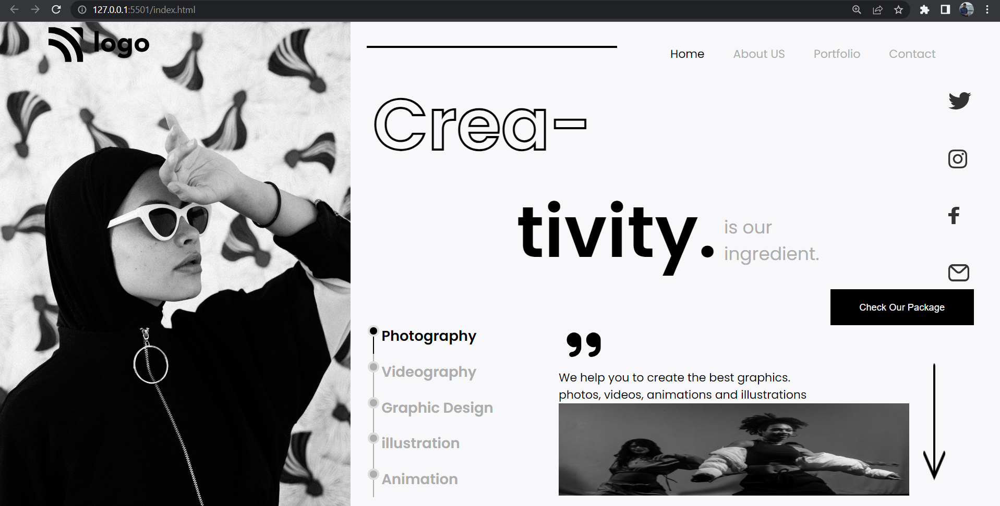
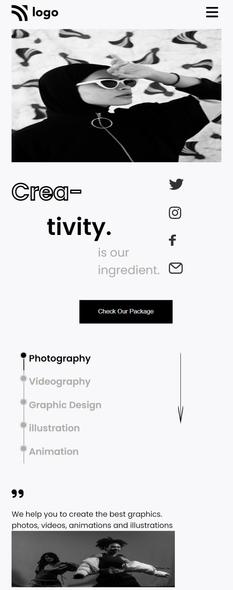

# Hi, I'm Venkatesh Koppar

## Things Learnt In this project:

1. Pseudo-element
2. Positions
3. Z-index
4. Margin
5. Padding

## Experience gained from this project:
Started with writing HTML code, was able to reproduce the required structure.Applied css styles by linking external style sheet. Used concepts of css like selectors which are used to target a particular class or a element. Got handson experience on using properties like margins, padding,borders etc.   

## Mobile View

## Time taken to complete this project:
6.5 hrs

## Application Link
https://dance-home.netlify.app/

### Techonology used:
1. HTML
2. CSS

### Softwares used:

